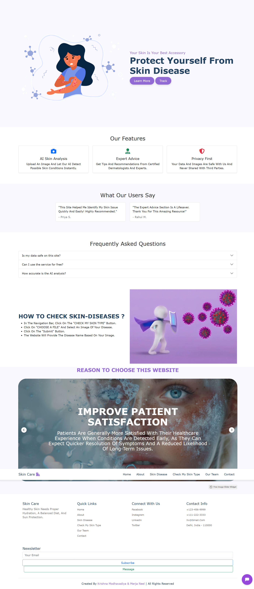
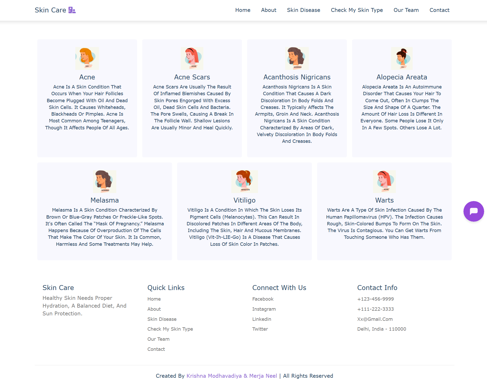
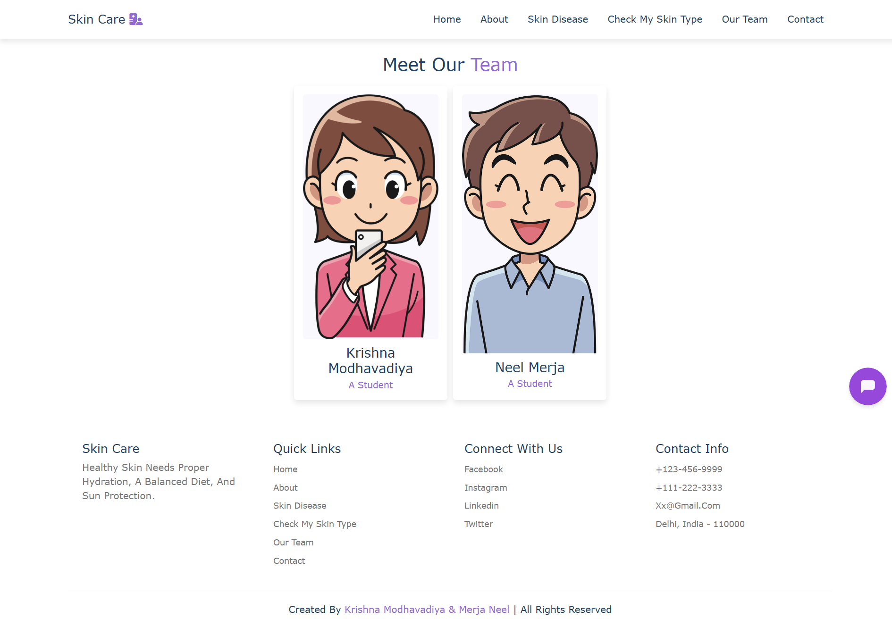
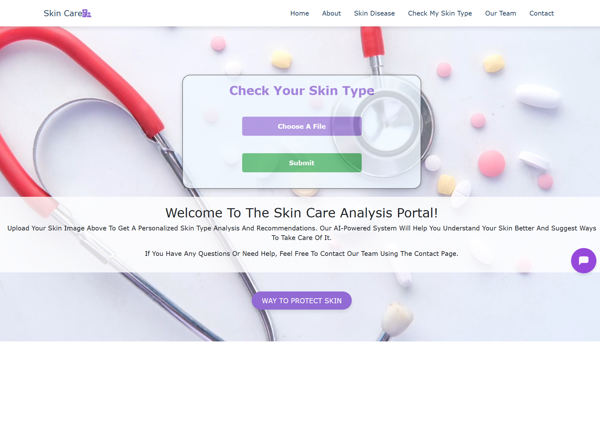

# Skin Care Web Application

A comprehensive web application for skin care advice and skin disease prediction using deep learning. Users can upload images to detect skin conditions and get personalized recommendations. Built with Flask (Python), HTML/CSS/JS, and a PyTorch model.

---

## Requirements
All Python dependencies are listed in `requirements.txt`. To install them, run:
```bash
pip install -r requirements.txt
```

**Main dependencies:**
- Flask
- Werkzeug
- Torch
- Torchvision
- Pillow

---

## Features
- **Skin Disease Prediction**: Upload skin images and get predictions for various conditions (e.g., acne, vitiligo, melasma, warts, etc.).
- **Skin Type Checker**: Find out your skin type and get relevant care tips.
- **Informative Pages**: Home, About, Team, Contact, Disease Info, and more.
- **User Messaging**: Contact form and subscription support.
- **Modern UI**: Responsive design with Bootstrap, animations, and media.

---

## Screenshots

Below are some screenshots showcasing the main features and UI of the Skin Care Web Application:

### Home Page


### About Page


### Skinproblem types Page



### Team Page


### Check Page



## Directory Structure
```
SKIN CARE/
├── app/
│   ├── __init__.py
│   ├── routes.py         # Flask routes and logic
│   ├── static/           # CSS, JS, images, uploads, videos
│   └── templates/        # HTML templates (home, about, contact, etc.)
├── Front-end/            # Additional JS for UI
├── Images/               # Image assets
├── predict.py            # Standalone prediction script
├── run.py                # Flask app entry point
├── skin-model-pokemon.pt # Trained PyTorch model
├── contact_submissions.json
├── individual_messages.json
├── subscribers.txt
├── latest_message.txt
├── requirements.txt
└── README.md             # Project documentation
```

---

## Setup & Installation
1. **Clone the repository**
   ```bash
   git clone <https://github.com/neel1112/skin_problem_detector.git>
   cd "SKIN CARE"
   ```
2. **Install dependencies**
   - Python 3.8+
   - Install required packages (Flask, Torch, Pillow, torchvision, etc.)
   ```bash
   pip install flask torch pillow torchvision
   ```
3. **Place the model file**
   - Ensure `skin-model-pokemon.pt` is in the project root.

---

## Usage
- **Run the web app**
  ```bash
  python run.py
  ```
- Open your browser and go to `http://localhost:5000`
- Navigate through the UI to check skin type, predict diseases, or explore info pages.

---

## Model Information
- The app uses a PyTorch model trained to classify skin diseases:
  - Supported classes: acanthosis-nigricans, acne, acne-scars, alopecia-areata, dry, melasma, oily, vitiligo, warts
- For standalone predictions, use `predict.py`:
  ```bash
  python predict.py --model skin-model-pokemon.pt --image path_to_image.jpg
  ```

---

## Authors & Credits
- Created by **Krishna Modhavadiya & Merja Neel**
- UI/UX: Bootstrap, custom JS, and CSS

---

## License
This project is for educational purposes. Please contact the authors for other uses.

---

## Contact
- Email: xx@gmail.com
- Location: Gujarat, India
